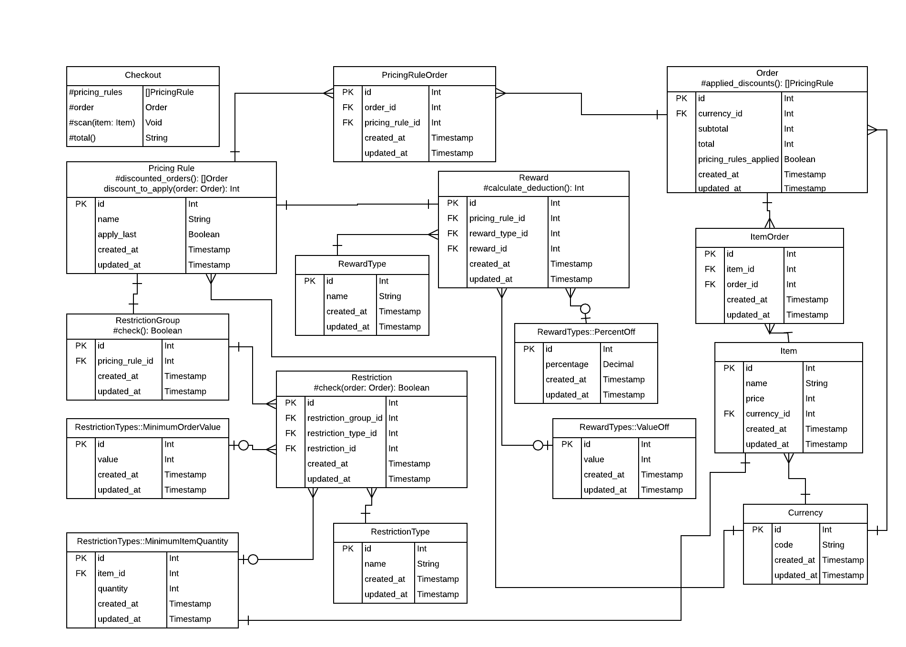

# Supermarket

This is a CLI tool that can be used to process orders made at a supermarket checkout.

<!-- vim-markdown-toc GFM -->

* [Prerequisites](#prerequisites)
* [Local Setup](#local-setup)
* [Running the app](#running-the-app)
* [Architectural decisions](#architectural-decisions)
  * [Currencies](#currencies)
  * [Pricing Rules](#pricing-rules)
  * [Orders](#orders)

<!-- vim-markdown-toc -->

## Prerequisites

* [Ruby v2.6+](https://www.ruby-lang.org/en/)
* [Bundler](https://bundler.io/)
* [PostgreSQL v10+](https://www.postgresql.org/)

## Local Setup

Rake commands for database operations are provided by the
[standalone_migrations gem](https://github.com/thuss/standalone-migrations).

To create the test and development databases:

    rake db:create

Run database migrations:

    rake db:migrate

Run migrations in the test environment:

    rake db:migrate RAILS_ENV=test

Seed the development database:

    rake db:seed

Clear all rows in the development database:

    rake db:seed deseed=true

Drop the test and development databases:

    rake db:drop

## Running the app

This repo is built with a CLI tool for that can be used to add and remove items
from an order and calculate the total amount that a customer will have to pay.

To initialise the CLI:

    ./supermarket.rb init

To view a list of the available items in the supermarket, run:

    ./supermarket.rb show_products

To scan a new item at the checkout, run:

    ./supermarket.rb scan [item ID]

To remove an item from an order, run:

    ./supermarket.rb remove [item ID]

To view the order receipt:

    ./supermarket.rb receipt

To view the order total:

    ./supermarket.rb total

## Architectural decisions

The supermarket CLI is a [Thor application](http://whatisthor.com/) that uses [active_record](https://guides.rubyonrails.org/active_record_basics.html) as an ORM and [standalone_migrations](https://github.com/thuss/standalone-migrations) to handle database operations. As alluded to earlier, the data that it uses is persisted in postgres though, to get around some of the limitations of writing a CLI, to manage this data, I have also added a temporay json file (./tmp/cli-data.json) that can be used to store serialised information shared between different CLI commands.

Below is the ERD that I worked whilst writing the app. It's somewhat crude (in
part because I'm not entirely sure how to represent polymorphic tables in UML)
but hopefully should give the observer some idea of the database schema.

### Currencies

The first table written was the `currencies` table and both `items` and `orders`
have a `belongs_to` relationship with it. This app assumes that a supermarket
will only handle items with a single currency so some changes would be needed to
support transactions in multiple currencies. Currently the app uses GBP by the
default and though the Checkout model lists currency as an optional parameter, the CLI currently does not allow the user to switch currency.

### Pricing Rules

Pricing Rules consist of two major components: the "Restrictions" that an order
must meet to become eligible for a discount and the "Reward" that is deducted from
an eligible order's total. Though the majority of pricing rules will only contain
a single restriction that corresponds to the reward, the app has been written to
allow of the creation of rules with multiple restrictions placed on it, which is
grouped into  `restriction_groups`. A pricing rule is only permitted to have one
reward associated with it. Currently, this means that pricing rules with more
than one restrictions may apply the same reward multiple times. It is unclear to
me whether this is desirable behaviour but as this represents an unusual
edge-case, I am relunctant alter this functionality.

Both Restrictions and Rewards can have various types associated with them. To
keep track of the different types of restriction (e.g., "Minimum Order Value")
and rewards (e.g., "Percent off") each type must have a corresponding table.
Each Restriction type must have a `check` method that will be used to determine
whether an order is eligible for a discount. Each Reward type must have a
`calculate_deduction` method which will eventually be aplied to the order total
displayed to the user. The two concepts are an attempt to model polymorphism at
the database level and splitting up the `PriningRule` entity in this way allows
for the creation of more modular pricing rules going forards.

### Orders

Scanned items in the app are added to an entity known as the "Order" model.
Halfway through the project, it did occur to me the "Basket" might have been a
more suitable name ("order" suggests a collection of items that have not yet
arrrived whereas the app is supposed to model behaviour found in a supermarket
which would involve a basket that the customer presents at checkout). This was
left unchanged as I felt that my time would be better spent elsewhere. Were this
CLI ever refactored, it might make sense to rename the model and related tables.

Orders are associated with Items via a `has_many :through` association. The join
table between them (`item_orders`) permits the insertion of duplicate rows in
order to handle the addition of duplicate items to a given order. This seemed
straighforward at the time but has actually made the removal of items from a
given order unusually difficult (the `.delete` and `.destroy` methods in active
record don't seem to work and some efforts to modify the array for specific orders resulted in more than one instance of an item being removed).

At present, this model has been set up to update both its `total` and `subtotal` columns in the database when a new item is added to an order.

